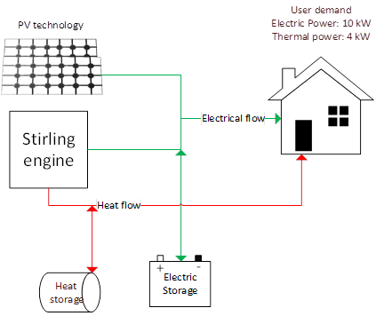

# SimEM
### Algebraic model
### Objective Function

$$ \sum_{i} C_{i} * CapCost_{Ci} *(AnnuF_{i} + FixCostOMF{i}) \frac {nh}{8760} ) $$
$$+\sum_{i,t} PowerProd_{i,t}(FuelCostF_{i}+VarCostOM_{i}) \\ + HeatProd_{i,t} (FuelCostF_{i}+VarCostOM_{i})  $$

| Power and heat technologies | Stirling | PV       | Electric Storage| Heat Storage | 
|-----:                       |----------| -------- | -------------   |--------------|
|     Capital Cost ($/kW)     |      1500| 2000     |   65            | 20           |
|     Interest Rate           |      0.1 | 0.1      |   0.1           | 0.1          |
|     Fix Cost O%M (%)        |     0.015| 0.01     |   0.05          | 0.01         |

